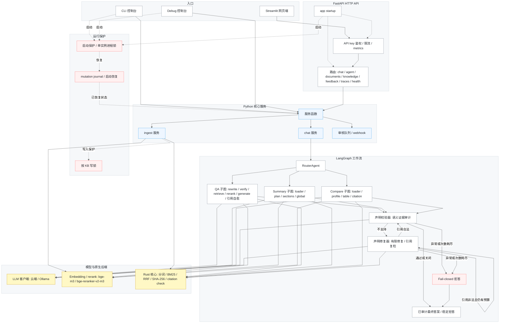
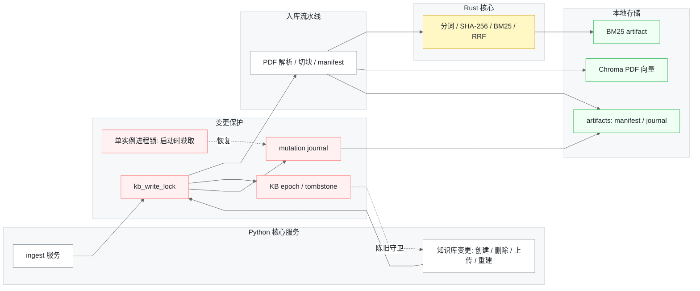
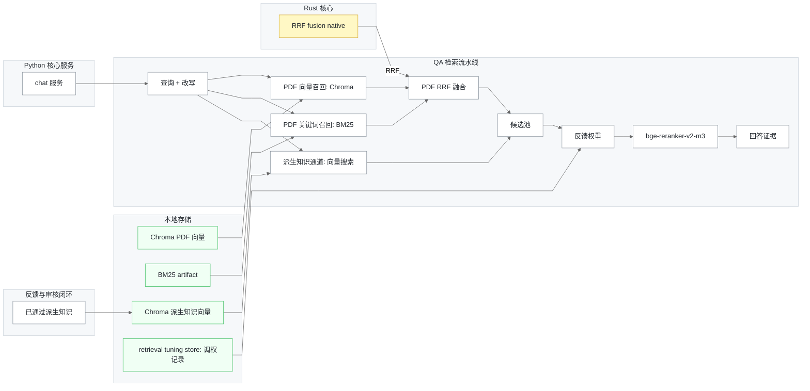
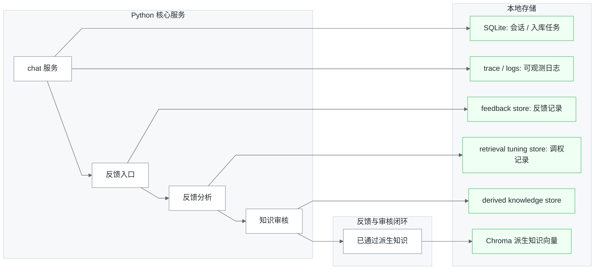

# CogDoc

> ⭐ **如果 CogDoc 对你有帮助，欢迎点个 Star** — 这是项目持续迭代和加新功能的动力。

[English](../README.md) · [简体中文](README_zh-CN.md)

一个面向个人 / 企业的本地 RAG 知识库控制台，上层是 **LangGraph 多 Agent 编排**，底层是**确定性 Rust 核心（PyO3 + maturin）**。它能处理 PDF、Markdown、HTML、Office、表格和图片来源，做问答、总结与对比，也能把反馈沉淀为可审核的派生知识。每条生成结论都会绑定到固定版本的来源位置：PDF 继续使用 `[source:Pn]`，幻灯片、单元格、文本行、图片和章节使用各自定位；所有引用均**经过校验，而非默认可信**。你可以用**命令行控制台**、基于 FastAPI 服务的 **Streamlit 网页端**，也可以用独立 **Debug 控制台**查看 trace。

> **可选本地 OCR。** OCR 默认关闭；开启后，原生文本不足的页面会由 PyMuPDF 渲染，并交给本机 Tesseract CLI 识别，带文字层的页面仍走现有快速路径。

## 功能特点

- **带可验证引用的问答** — 生成被约束在召回的文档块内；捏造的文件/页码标签会被 Rust 校验器抓出，并在自愈循环里重新生成。

- **可选的逐声明语义门禁** — 物理引用校验通过后，可由独立校验器逐条核对事实声明与其显式引用的证据；系统只做有限次数修复，仍无法确认支持度时以稳定拒答 fail-closed。

- **感知需求的证据门禁** — 多部分问题会拆成最多 3 个原子证据需求，检索时保留显式归因，再对闭集 chunk 逐项校验；默认仅允许一轮有界恢复检索，仍不完整则 fail-closed 拒答。

- **单文档结构化摘要** — 固定章节，引用从 chunk 元数据确定性绑定。

- **多文档对比** — 在固定维度上逐文档建 profile，按维度渲染带引用的对比块。

- **混合检索、query-level 融合** — 每条原问题、改写查询和需求专用查询都会检索 PDF 向量+BM25 混合 channel 与已审核派生知识 channel；产生的 query/channel 排名等权进入确定性 RRF，requirement quota 防止后出现的聚焦查询在重排前被饿死。分词与 BM25 均为 native——中文走 `jieba-rs`，英文做小写化 + Snowball 词干化 + 停用词过滤。

- **结构感知 Parent–Child 上下文** — 保守识别 Markdown、编号及中英文常见标题并形成章节父块。召回、重排和引用仍精确到 child chunk，命中后只从同章节补充有界连续 sibling 窗口；旧索引或无结构文档继续回退现有的前后各一块逻辑。

- **内容寻址的增量缓存** — 逐文件 SHA-256 manifest 加带版本的 chunk 身份契约：未变化的文件直接复用已建索引，只有 PDF 内容或切块方案真正变化时才增量重建。
- **知识源运维控制面** — 本地目录、Git、URL、Zotero、Notion、Confluence、SharePoint 与 S3 共用一套可恢复同步 runtime，支持 checkpoint、健康快照、死信/重放、预算与 fail-closed ACL 映射。连接密钥可使用 AES-256-GCM 凭据库、手工轮换或 Notion/Atlassian/Microsoft OAuth，旧环境变量引用继续兼容；管理员还可浏览来源目录、下载/比较不可变版本，并软删除/恢复历史原始 artifact。详见[连接器说明](CONNECTORS_zh-CN.md)。

- **可选分布式控制面与不可变索引发布** — PostgreSQL 租约队列、单线程持久调度、transactional outbox、S3 generation 和 fencing/CAS 发布协议可横向扩展后台 worker；任何不完整或过期 worker 生成的索引都不能切成 current。主 API 仍保持单 writer，完整边界与上线步骤见[高可用部署指南](HA_DEPLOYMENT_zh-CN.md)。

- **多知识库 · 多对话 · 分层记忆** — 完整展示历史持久化用于回放；通过引用校验的近期回合组成有界短期记忆，被淘汰回合转为会话级摘要和决策，只有带明确记忆信号的稳定事实才进入跨会话长期记忆，错误答案不会进入 Agent 记忆。

- **可复现证据的 Deep Research 工作台** — AI 生成或人工编辑带原子证据需求的大纲，每个需求复用生产混合检索链执行，并通过持久 attempt lease 安全暂停、恢复和取消。准入、阶段截止时间、检索/文档/LLM/输入预算以及旧 worker 的迟到提交均有界且 fail-closed。报告声明会被独立审计，每个原子需求还必须由已支持且有引用的声明覆盖；两道门共享最多一次修复，仍不充分则 fail-closed。每次执行都会冻结索引、来源、派生知识、调权与检索契约版本；证据过期后必须刷新才能审阅或发布，发布同时提供完整性校验过的 Markdown 与确定性验证包。带 keyset 分页和 ETag 的轻量摘要索引使任务轮询不再随报告和证据体积增长。

- **网页端、CLI 与 Debug 入口** — 斜杠命令 CLI、基于 FastAPI 的 Streamlit 网页端，以及聚焦 trace 诊断的 `make debug` 控制台。

- **派生知识审核闭环** — 支持手动新增知识、保存已校验答案、把纠错/无依据反馈转成待审核知识卡片；每条知识可绑定来源、检测冲突、扫描过期、创建修订版本，并支持批量通过/驳回、归档和删除。

- **反馈分析与归因检索调权** — 赞踩、纠错、评分、问题类型和 evidence 上下文按 `trace_id` 落盘；正向信号可提升被引用 chunk，负向信号只有在 `feedback_type=bad_retrieval` 时才惩罚它们。`skip_retrieval_feedback=true` 可让单条反馈不参与调权，所有调权记录仍可审核、可回滚。
- **证据级检索评测数据飞轮** — 只有完整成功的服务端 trace 加显式 `thumbs_down` / `bad_retrieval` 才会生成未标注草稿，统一覆盖 QA requirement、Summary section 和 Compare source×dimension；gold chunk/span 与 hard negative 只能由授权审核者补充，索引代、chunk 身份契约或来源 SHA 变化后审批和导出都会 fail closed。

- **Trace 可观测、审核队列与 webhook** — 每次请求可导出安全 JSON trace，包含请求配置、节点耗时、改写、证据预览与错误摘要；网页端只展示当前对话的 trace，并把待审核/过期知识、反馈分析、检索调权聚合成审核队列，也可在新待审核知识产生时投递 webhook。

- **真实账号、企业 OIDC/SCIM、持久服务令牌、团队工作区与检索 ACL** — 可选持久账号支持密码或 RS256/PKCE 企业登录、可撤销会话、工作区级[会话安全策略](SESSION_SECURITY_zh-CN.md)、SCIM 2.0 预配，以及工作区级服务账号和一次性、有期限、可在线撤销的 API Token。知识库/文档策略和主体 grant 会在向量与 BM25 的 top-k 之前生效，并在证据进入 Prompt、Trace 或后台 Research 前再次复验。详见 [OIDC](OIDC_zh-CN.md)、[SCIM](SCIM_zh-CN.md) 与[服务账号](SERVICE_ACCOUNTS_zh-CN.md)指南。

## 功能演示

1. **网页端对话、引用与证据。** 选一个知识库，自然语言提问，实时查看执行进度，再接收已完成终态处理的答案，展开引用来源和证据片段，并打 👍/👎 反馈。

   

2. **命令行控制台。** 用斜杠命令管理知识库、入库、多对话历史和强制任务模式。

   

3. **独立 Debug 控制台。** `make debug` 针对一个知识库调试，普通提问后可继续用 `/trace`、`/steps`、`/rewrite`、`/evidence`、`/config` 查看细节，也可以用 `/retrieve <问题>` 只看召回与重排结果。

   

4. **带引用的问答。** 每条事实性句子都以引用结尾，且引用的文件名和页码必须存在于本轮检索上下文中；非法引用会把回答打回重新生成。

   

5. **结构化摘要。** 把一篇点名文档总结为固定章节，每节带确定性引用。

   

6. **多文档对比。** 对两篇或更多点名文档逐方法、逐指标对比，每个单元格都带引用。

   

7. **Trace 调试面板。** 只查看当前对话的 trace，可视化路由判别、问题改写、召回与重排、请求配置和引证审计。

   

8. **派生知识审核中心。** 新增知识、保存答案、检查来源绑定、查看冲突、通过/驳回/归档待处理项，并重建已通过派生知识索引。

   

9. **反馈与调权。** 每次赞踩、纠错和无依据反馈都会关联到本次回答的 `trace_id`、问题、答案、引用与证据；系统会把坏样本沉淀到评测台账，把可修正内容转为待审核派生知识，并生成可启用/禁用的检索调权记录，让后续召回排序能被人工反馈持续校正。

   

## 快速开始

```bash
python -m venv .venv
source .venv/bin/activate
pip install -e ".[dev,frontend]"   # 运行时 + 构建/测试 + Streamlit 依赖
make native     # 构建 Rust 扩展：cd rust_core && maturin develop --release
make check      # 校验扩展及其 native 符号
make run        # 构建/复用索引、预热模型、启动控制台
```

依赖统一在 [pyproject.toml](../pyproject.toml)：运行时依赖在 `[project.dependencies]`，`dev`（构建/测试）与 `frontend`（Streamlit 客户端）为可选 extras；完整本地体验建议安装 `.[dev,frontend]`。包采用 `src/` 布局（`src/cogdoc/`）；`make` 目标会把 `src/` 加入 `PYTHONPATH`，因此跑测试无需先安装。

把 `.env.example` 复制为 `.env`，至少设置云端 `LLM_API_KEY`（或用 `/local` 走 Ollama）。把受支持的文档放进收件箱 `your_documents/`（或设置 `COGDOC_DOC_DIR`）。每次修改 `rust_core/src/` 下的代码后都必须重跑 `make native`——`.so` 不会自动重建，也不纳入版本控制。

持久账号默认关闭，保证旧部署升级后行为不突变。个人或团队部署应设置 `COGDOC_ACCOUNT_AUTH_ENABLED=true`，启动 API 后注册首位 owner，并使用返回的 Bearer token。企业可随后配置 [OIDC 单点登录](OIDC_zh-CN.md)，按需接入 [SCIM 2.0](SCIM_zh-CN.md) 预配用户/组，再设置 `COGDOC_SELF_REGISTRATION_ENABLED=false` 关闭公开注册。

## 使用流程

CLI 和网页端共用同一条 建库 → 入库 → 提问 流程。先按[快速开始](#快速开始)装一次环境：安装依赖、构建原生扩展（`make native && make check`）、配置 `.env`、把 PDF 放进 `your_documents/`。

### 命令行控制台

```bash
make run            # python -m cogdoc.cli
```

之后在控制台里用斜杠命令完成全部操作：

1. `/kb new <名称>` — 建知识库，`/kb` 列出/切换。
2. `/add <文件名>` — 把收件箱 `your_documents/` 里的受支持文档加入当前库（同步重建索引）。
3. `/new` — 开新对话；`/chats`、`/open` 浏览持久化历史。
4. 直接提问走 **QA**；"总结 `<文件>`" 走 **Summary**；"对比 `<a>` 和 `<b>`" 走 **Compare**。
5. `/cloud` 用云端 LLM，`/local` 用 Ollama；`/help` 列出命令；`exit` 退出。
6. `/dk` 或 `/knowledge` 管理派生知识，`/feedback` 查看反馈与反馈分析，`/tuning` 控制检索调权，`/review` 查看审核队列摘要、闭环指标和导出结果。

`make debug` 打开针对单个库的独立 Debug 控制台。可以直接提问获得回答和 trace 摘要，再用 `/trace`、`/steps`、`/rewrite`、`/evidence`、`/config` 查看最近一次请求，也可以用 `/retrieve <问题>` 只检查召回和重排输出、不调用 LLM。需要直接调试指定知识库时，可运行 `python -m cogdoc.debug --kb <kb_id>`。

### 网页端（Streamlit + FastAPI）

```bash
make serve          # 终端 1：FastAPI，地址 http://localhost:8000
make frontend       # 终端 2：Streamlit 网页端（自动在浏览器打开）
```

在浏览器里：

1. **账号** — 开启账号鉴权后先注册或登录，再选择个人/团队工作区。
2. **侧栏 → 知识库** — 新建一个库，或选择已有的库。
3. **侧栏 → 文档** — 上传受支持的文档/图片，或配置持久来源连接；状态面板会跟踪同步与后台索引直到完成。
4. **对话** — 新建对话或重开历史对话（会话和知识库持久化进 URL，刷新后续上同一对话）。
5. **聊天** — 选模式（`auto` / `qa` / `summary` / `compare`），提问，查看实时进度，再读取已完成终态处理的答案及其引用来源、证据片段和 👍/👎 反馈。
6. 在侧栏打开 **本地 Ollama 模式** 即可把生成切到本地模型。
7. 打开 **调试**，只查看当前对话的请求 trace；也可以用 **检索调试** 直接调用 `/v1/retrieve`，检查命中 chunk、重排分数和 retrieval 元数据。
8. 切到主视图里的 **派生知识**，可以新增知识、审核待处理/过期项、查看反馈分析、启用/禁用检索调权、导出审核队列，并在文档变化后扫描过期绑定。
9. 具备 Reviewer 权限时，可从当前知识库的 **调试 → RAG 评测** 进入离线评测工具，标注检索证据或核验回答声明；这些标注仅属于当前知识库，用于评测与改进，不会直接改写当前 RAG。

### 直接调用 API

Streamlit 前端只是 FastAPI 服务上的瘦客户端——你也可以直接调用：

| 端点 | 用途 |
| --- | --- |
| `GET /v1/auth/config`、`POST /v1/auth/register`、`POST /v1/auth/login` | 查询账号模式、创建账号/个人工作区，或签发不透明 Bearer 会话 |
| `POST /v1/auth/oidc/authorize`、`GET /v1/auth/oidc/callback`、`POST /v1/auth/oidc/exchange` | 执行带 PKCE/nonce 的企业登录，并用一次性浏览器 handoff 换取普通 CogDoc 会话 |
| `POST /v1/auth/oidc/link/authorize`、`GET/DELETE /v1/auth/oidc/identities[/{id}]` | 显式绑定、查看或解绑联邦身份 |
| `GET/PUT /v1/workspaces/{id}/oidc-policy` | owner/admin revision-safe 管理工作区 issuer/邮箱域 JIT 准入 |
| `GET /v1/workspaces/{id}/scim-status` | owner/admin 查看不含 token/fingerprint 的目录同步状态 |
| `GET/POST /scim/v2/Users`、`GET/PUT/PATCH/DELETE /scim/v2/Users/{id}` | 使用工作区专用 Bearer 执行 SCIM 用户预配、更新、停用与软删除 |
| `GET/POST /scim/v2/Groups`、`GET/PUT/PATCH/DELETE /scim/v2/Groups/{id}` | 同步 SCIM 组成员，并按服务端精确组名映射角色 |
| `GET/POST /v1/workspaces/{id}/service-accounts`、`PATCH/DELETE .../{service_account_id}` | owner/admin 管理持久非人类主体、实时角色与停用状态 |
| `GET/POST .../service-accounts/{id}/tokens`、`DELETE .../tokens/{token_id}` | 一次性签发、查看 metadata 或 revision-safe 撤销服务 token |
| `GET/PUT /v1/workspaces/{id}/service-account-policy` | 管理服务账号/token 数量、TTL、永久凭据和权限上限 |
| `GET/PUT /v1/workspaces/{id}/session-policy` | 管理用户会话空闲/绝对时长与每用户并发上限 |
| `GET/DELETE /v1/workspaces/{id}/security-sessions[/session_id]` | 分页盘点安全会话元数据并按工作区撤销 |
| `GET /v1/auth/me`、`POST /v1/auth/logout`、`POST /v1/auth/logout-all` | 查看当前身份，或撤销单个/全部登录会话 |
| `GET /v1/auth/sessions`、`DELETE /v1/auth/sessions/{id}`、`POST /v1/auth/change-password` | 管理设备会话与修改密码 |
| `GET/POST /v1/workspaces`、`POST /v1/workspaces/{id}/switch` | 列出/创建工作区，并切换当前登录会话的活动工作区 |
| `GET /v1/workspaces/{id}/members`、`PATCH/DELETE /v1/workspaces/{id}/members/{member_id}` | 列出成员、调整角色或移除成员 |
| `GET/POST /v1/workspaces/{id}/roles`、`DELETE /v1/workspaces/{id}/roles/{role_id}` | 列出内置/自定义角色、创建继承内置权限模板的角色并删除未使用角色 |
| `POST/GET /v1/workspaces/{id}/invites`、`DELETE .../invites/{invite_id}`、`POST /v1/auth/invitations/accept` | 签发、查看、撤销或接受一次性工作区邀请 |
| `GET /v1/tenant` | 查看当前工作区、主体、角色、权限与配额使用量 |
| `GET /v1/audit-events` | 分页读取当前工作区的哈希链审计元数据（owner/admin） |
| `POST/GET /v1/audit-events/exports`、`GET .../{job_id}/content` | 创建、轮询与下载带完整性摘要的租户审计 NDJSON 导出 |
| `POST /v1/knowledge-bases`、`GET /v1/knowledge-bases` | 创建 / 列出知识库 |
| `GET/PATCH /v1/knowledge-bases/{kb}/access` | 查看或切换知识库的 `workspace` / `private` 策略 |
| `GET/PATCH /v1/knowledge-bases/{kb}/documents/{document_id}/access` | 查看或切换文档的 `inherit` / `workspace` / `private` 策略 |
| `GET/POST/DELETE .../access/grants[/subject_id]` | 在知识库或文档级管理主体 grant |
| `POST /v1/knowledge-bases/{kb}/documents` | 上传 + 入库受支持的文档/图片（返回异步 `job_id`） |
| `GET/POST /v1/knowledge-bases/{kb}/connections` | 查看或创建使用 vault 凭据/环境引用的持久来源连接 |
| `GET/POST /v1/knowledge-bases/{kb}/connector-credentials` | 查看 metadata 或加密写入手工凭据（secret value 只写不回显） |
| `PATCH/DELETE .../connector-credentials/{credential_id}`、`GET .../connector-credentials/audit/events` | 带 revision 保护地轮换/删除凭据，或查看不含密钥的凭据审计事件 |
| `POST /v1/knowledge-bases/{kb}/connector-oauth/authorize`、`GET /v1/auth/connector-oauth/callback/{provider}` | 执行一次性的 Notion、Atlassian 或 Microsoft OAuth 流程 |
| `POST .../connector-credentials/{credential_id}/refresh` | 刷新已保存的 OAuth 凭据 |
| `POST /v1/knowledge-bases/{kb}/connections/{id}/sync` | 启动可恢复同步 |
| `GET /v1/knowledge-bases/{kb}/sync-jobs`、`GET /v1/knowledge-bases/{kb}/connection-health` | 查看任务、调度、失败、backlog 与连接健康状态 |
| `POST /v1/knowledge-bases/{kb}/sync-jobs/{job_id}/replay` | 从最近成功 checkpoint 把死信重放为新任务 |
| `GET /v1/knowledge-bases/{kb}/source-catalog[/{source_id}]` | 按连接/健康浏览运维来源目录及投影的文档 ACL 状态 |
| `GET .../source-catalog/{source_id}/versions`、`/diff`、`.../{version_id}/content` | 查看、有界比较或完整性校验下载不可变原始版本 |
| `DELETE .../{version_id}/artifact`、`POST .../source-artifacts/{recovery_token}/restore` | 软删除非当前原始版本，或用作用域恢复令牌还原 |
| `GET .../source-artifacts/usage`、`DELETE .../source-artifacts/trash?older_than=...` | 查看活动区/trash 用量，或按 epoch 边界不可逆清理作用域 trash |
| `GET /v1/knowledge-bases/{kb}/sources`、`GET /v1/knowledge-bases/{kb}/sources/{source}/chunks` | 浏览已索引来源文件与 chunk 预览 |
| `GET /v1/index-jobs/{job_id}` | 轮询入库进度 |
| `POST /v1/chat`、`POST /v1/chat/stream` | 提问（JSON 或 SSE 流式） |
| `POST /v1/summary`、`POST /v1/compare` | 显式执行 Summary / Compare，避免路由歧义 |
| `POST /v1/retrieve` | 返回 child 级检索命中，包含 parent/section 身份、source/page 预览和排序元数据 |
| `GET /v1/sessions`、`GET /v1/sessions/{id}/history` | 列出 / 回放对话历史 |
| `GET /v1/sessions/{id}/memory` | 查看短期、中期和长期记忆快照 |
| `DELETE /v1/memory/long-term?doc_id=...` | 清除一个知识库的长期记忆 |
| `GET /v1/traces?doc_id=...&session_id=...` | 列出最近 trace，可限定到某个知识库/会话 |
| `GET /v1/traces/{trace_id}` | 查询已导出的请求 trace |
| `POST /v1/feedback` | 按 `trace_id` 提交赞/踩 |
| `GET /v1/feedback`、`GET /v1/feedback-analysis` | 浏览反馈记录与结构化反馈理解结果 |
| `POST /v1/knowledge`、`GET /v1/knowledge` | 创建 / 查询派生知识 |
| `POST /v1/knowledge/{id}/approve`、`/reject`、`/archive`、`/revise` | 审核或修订派生知识 |
| `POST /v1/knowledge/batch-approve`、`POST /v1/knowledge/batch-reject` | 批量审核派生知识 |
| `GET /v1/knowledge/pending-count`、`GET /v1/knowledge/index-status`、`POST /v1/knowledge/stale-scan` | 查询待审/过期数量、派生知识索引状态和过期来源绑定 |
| `GET /v1/review-queue`、`GET /v1/review-queue/export` | 汇总并导出审核队列 |
| `GET /v1/feedback-loop-metrics` | 返回反馈 / 审核 / 调权闭环指标 |
| `GET /v1/retrieval-feedback`、`POST /v1/retrieval-feedback/{id}/enable`、`POST /v1/retrieval-feedback/{id}/disable` | 查看或回滚反馈生成的检索调权 |
| `GET /v1/retrieval-eval-drafts`、`GET /v1/retrieval-eval-drafts/{id}` | 查看证据单元标注草稿及实时过期状态 |
| `POST /v1/retrieval-eval-drafts/{id}/review` | 带 revision 乐观并发校验地通过或驳回草稿 |
| `GET /v1/retrieval-eval-drafts/export` | 导出已通过且未过期的 training/release-gate 数据；QA 专用格式会显式报告被排除的 Summary/Compare 草稿 |
| `GET /v1/claim-verification/reviews`、`/summary`、`/{review_id}` | 分页读取经 ACL 过滤的生产声明样本、汇总审核者可见指标，并按需获取证据详情 |
| `POST /v1/claim-verification/reviews/{review_id}/label` | 带 revision 乐观并发校验地提交人工结论 |
| `GET /v1/claim-verification/reviews/export` | 分页导出声明核验评测格式的已审核数据 |
| `POST /v1/research-jobs`、`GET /v1/research-jobs` | 创建或列出持久化研究计划 |
| `GET /v1/research-jobs/{id}`、`PUT /v1/research-jobs/{id}/plan` | 查询或带版本冲突保护地修订研究大纲 |
| `POST /v1/research-jobs/{id}/plan/auto` | 生成每章含 1–3 个原子证据需求的可编辑大纲 |
| `POST /v1/research-jobs/{id}/start`、`/pause`、`/resume`、`/cancel` | 控制持久化的逐章节证据检索 |
| `GET /v1/research-jobs/{id}/provenance`、`POST /v1/research-jobs/{id}/refresh` | 查看冻结的证据输入，或归档旧报告并全量刷新过期证据 |
| `POST /v1/research-jobs/{id}/generate`、`GET /v1/research-jobs/{id}/report` | 对章节证据执行闭集校验、生成带引用正文并下载 Markdown 报告 |
| `PUT /v1/research-jobs/{id}/review`、`POST /v1/research-jobs/{id}/publish` | 带 revision 冲突保护地逐章审阅正文或证据缺口，并只发布完成全部审阅的报告 |
| `GET /v1/research-jobs/{id}/published-report`、`/published-bundle` | 下载通过完整性校验的 Markdown 快照或确定性 ZIP 验证包 |
| `GET /v1/claim-verification/observations/summary` | 仅 Reviewer 可读的租户级灰度窗口与运行就绪摘要 |
| `GET /healthz`、`GET /readyz`、`GET /metrics` | 健康、就绪、Prometheus 指标 |

`/v1/chat/stream` 始终会流式发送生命周期和节点进度事件。QA、Summary 和
Compare 的中间模型文本可能包含内部 Evidence ID，且尚未通过终态处理，
因此会被有意缓冲；客户端不会收到逐 token 正文，而是在常规 `final` 事件前，
通过单个 `token` 事件收到最终答案。其他任务保留实时模型 token，除非全局声明校验门禁要求缓冲。

### 知识源运维与连接凭据

凭据、OAuth、source catalog、artifact 变更、同步取消和死信重放都要求知识库级 `manage_access`；普通读者只能通过只读接口查看连接、任务与健康摘要。OAuth callback 的公开仅用于供应商浏览器跳转：高熵 state 在服务端短时保存、只能消费一次，并绑定发起人的 tenant、KB、connection 与 user。Microsoft 使用 S256 PKCE，所有供应商 token 最终都进入加密凭据库。

凭据库使用每 revision 随机数据密钥与 AES-256-GCM 信封加密。轮换主密钥时先把新旧 key 同时放入版本化 keyring、切换 active ID，再 PATCH 每条旧凭据（不改 secret 也可重包装），确认同步成功后才能移除旧 key。每条连接只能二选一使用 `credential_id` 或 `secret_env`。不配置 vault 时，vault/OAuth 接口会 fail closed，但已有环境引用连接不受影响。

每次同步都会更新持久 health、低基数 Prometheus 指标，并可发送 `connector.sync.retry|succeeded|failed|dead_letter` webhook。可重试故障耗尽 attempt 后形成不可变死信；replay 会新建带 `replay_of` 的任务，从最后成功 checkpoint 继续。原始版本独立存放在 `COGDOC_DATA_DIR/source-artifacts`，下载/diff 会验证 SHA-256，默认保留 10 个活动版本，手工删除进入可恢复的 store-local trash；trash purge 必须显式执行且不可逆。备份必须在停止写入后同时保存 `data/` 和外部 vault keyring；`make backup` 默认不会包含 `.env`。配置字段、完整接口、指标、RBAC、轮换和恢复演练见[连接器说明](CONNECTORS_zh-CN.md)。

### 账号、工作区与 RAG 权限

`COGDOC_ACCOUNT_AUTH_ENABLED=false` 是向后兼容默认值。设为 `true` 后启用持久真人身份：注册会在一个事务内创建用户、owner 成员关系、个人工作区及登录会话。密码最少 12 个字符，以带版本和随机盐的 scrypt 哈希保存。登录会话与邀请值都是只在签发时返回的不透明 bearer 秘密，数据库仅保存其 SHA-256 摘要，邀请只能使用一次。会话会过期，可单独或全量撤销；修改密码会撤销其他活动会话；连续登录失败会触发可配置的临时锁定。客户端用 `Authorization: Bearer <token>` 发送会话，不应把 token 放入 URL 或日志。

owner 可管理工作区本身；admin 同时拥有写入、删除、审核/发布和权限管理；editor 可读、查询和写入；reviewer 可读、查询、审核和发布；viewer 可读和查询。owner/admin 管理成员与邀请，但普通角色修改不能凭空产生另一个 owner，也不能移除最后一位 owner。切换工作区会改变该登录会话的兼容活动工作区；新版客户端还会在每个受保护请求中发送非敏感的 `X-CogDoc-Workspace` 选择器，因此两个共用同一 Bearer 的浏览器标签页也能各自固定到不同成员关系。服务端仍会验证该成员关系；选择器与 `/v1/workspaces/{id}` 路径冲突时以不透明 404 fail-closed。不带该 header 的旧客户端继续使用 session 活动工作区。同一公开 slug 的知识库按工作区使用不同物理身份；真人账号的对话会话与 Trace 还会按用户分隔。跨工作区请求统一表现为资源不存在，不泄露另一租户的资源。

新知识库默认采用 `workspace`，新上传文档默认采用 `inherit`。`private` 知识库只对资源 owner、工作区 owner/admin，或得到知识库 grant 的同工作区主体可见。文档可继承知识库、单独开放给工作区，或设为 private；文档 grant 只开放对应文档。grant 角色权限与工作区角色权限取交集，因此不能借 ACL 提权。账号模式下 ACL 缺失、损坏或不可用都会拒绝访问。只有具备 `manage_access` 的 owner/admin 能修改策略与 grant。

工作区同时提供 `owner/admin/editor/reviewer/viewer` 五个内置角色，其中邀请未显式指定角色时默认 `viewer`（前端显示为“普通成员”）。owner/admin 可创建拥有独立 `role_id` 的自定义角色；自定义角色继承一个非 owner 内置权限模板，但文档访问匹配使用独立角色 ID，不会把同一权限模板下的所有用户混为一组。成员始终只绑定一个有效角色。创建知识库、上传文档以及后续访问权限编辑都可提交角色 allowlist：知识库 allowlist 是父级边界，文档 allowlist 在其上继续取交集；没有 allowlist 的存量资源保持原 ACL 行为。仍被成员、知识库或文档引用的自定义角色不能删除。

查询权限会固化成明确的 `ALL`、非空 `SUBSET` 或 `DENY`。当结果为子集时，Chroma 向量过滤、BM25 候选选择、已审核派生知识、Summary、Compare 与 QA 都会在 top-k/重排之前使用来源 allowlist；融合后还有第二道过滤，防止过期或自定义后端忽略过滤后把越权结果带入 Prompt、Trace 或持久证据。这也避免高分越权 chunk 在 top-k 中挤掉可见证据。后台 Research 会冻结创建者及精确来源边界，在召回前后重新检查当前成员关系和 ACL；无法执行子集过滤的后端会被拒绝，权限撤销会中止任务，后续新增授权也不会静默扩大已经运行的任务范围。

静态服务主体仍可用于自动化和分阶段升级。`COGDOC_API_PRINCIPALS` 把每个 key 映射到 `tenant_id`、`subject_id` 与角色；旧 `COGDOC_API_KEYS` 和 `COGDOC_EVAL_REVIEW_API_KEYS` 仍作为 `default` 工作区 admin。开启账号鉴权后，显式服务 key 与真人会话可以并存；关闭账号鉴权时，只有三类静态凭据全部为空才进入开放本地 owner 模式。同时发送 Bearer 与 `X-API-Key` 时 Bearer 优先。显式 reviewer/admin/owner 可使用证据评测和 Research 审核接口，落盘操作人始终来自认证身份。硬配额覆盖知识库数、已提交加在途 PDF 数及 PDF 字节；`/v1/tenant` 返回 `limits`、`usage`、`reserved`，超限返回 HTTP 409 与 `TENANT_QUOTA_EXCEEDED`。

`COGDOC_API_KEY`（单数）是 Streamlit/CLI 客户端向外发请求时使用的凭据，不是服务端的 key 白名单。如果 Streamlit 进程设置了它，而当前浏览器没有真人会话 token，界面会按设计直接进入服务 key 模式并跳过账号登录页。共享或多用户前端必须留空该变量；API 端用 `COGDOC_API_KEYS` / `COGDOC_API_PRINCIPALS` 配置可接受的服务身份，真人用户应正常登录。单数 key 只适合受信的单用户控制台或专用自动化前端。

模块级生产应用把纯元数据事件持久追加到 `COGDOC_DATA_DIR/audit/events.jsonl`：修改操作执行前写 intent，发送响应头前写 HTTP response-commit；读取操作只写后者。链损坏或不可写时，受保护流量以 HTTP 503 fail-closed。`GET /v1/audit-events` 按当前工作区 sequence 倒序分页，`before_sequence` 是排他游标。公开探针/文档及未认证的 401 尝试不入审计。每工作区 SHA-256 链可在进程存活期间识别 malformed、截断、改写和断链，并在重启后验证自身一致性，但它不是签名、WORM 或外部可信 head；若威胁模型包含恶意文件系统写入，必须备份并在外部锚定。

### 分层记忆

| 层级 | 范围 | 内容 | 存储与遗忘 |
| --- | --- | --- | --- |
| 工作/短期记忆 | 单次图运行和当前会话 | 当前目标、任务状态、工具状态、最近通过引用校验的回合 | 图状态加 SQLite 有界会话窗口；同时按消息数和字符数淘汰旧回合 |
| 中期记忆 | 单个会话 | 被淘汰回合的抽取式摘要、显式目标和决策 | `sessions.mid_memory`；随会话删除 |
| 长期记忆 | 同一知识库下的多个会话 | 仅保存显式记忆、稳定偏好、长期规则和项目事实 | `long_memories` 去重记录，受重要性和容量限制，可通过 API 清除 |

前端完整回放历史与 Agent 记忆相互独立。默认预算为短期 12 条消息和 6000 字符、中期摘要 4000 字符、长期保存 64 条事实、每次注入 8 条长期事实；可用 `.env.example` 中的 `COGDOC_MEMORY_*` 配置调整。

记忆召回会使用当前问题。CogDoc 分别执行短期新近性召回、中英文关键词召回、长期重要性/新近性召回和可选的 BGE-M3 语义召回，再通过加权 RRF 融合排名并按层级预算装入上下文。可配置数量的最近消息固定保留以维持连续性。短期工作集已有新近性和关键词通道，因此默认不参与语义召回，可按需单独开启；嵌入失败时会自动退化到其余通道。所有通道权重和数量限制均可通过 `COGDOC_MEMORY_*` 配置。

## 技术栈

- **确定性内核** — 自研 [Rust](https://www.rust-lang.org/) 扩展（[PyO3](https://pyo3.rs/) + [maturin](https://www.maturin.rs/)）扛下 `jieba-rs` 中英分词、BM25、RRF 融合、SHA-256 manifest 与引用校验，全部 native、独立单测，不随 Agent / Prompt 漂移。
- **检索** — `bge-m3` 多语言向量召回 + BM25 关键词召回，Rust RRF 融合后再用 `bge-reranker-v2-m3` 精排；PDF 向量和已通过派生知识向量都落 [Chroma](https://www.trychroma.com/)，PDF 解析走 PyMuPDF。
- **编排** — [LangGraph](https://langchain-ai.github.io/langgraph/) 把路由 → 任务子图 → 物理引用自愈 → 可选父图声明审计 / 有限修复 / 拒答串成可循环状态图。
- **模型** — OpenAI 兼容双后端、一键热切：云端 DeepSeek，本地 Ollama `qwen2.5:7b`。
- **服务与可观测** — FastAPI 提供 SSE 流式接口、可选持久账号/服务 key 鉴权、工作区 RBAC/资源 ACL 与令牌桶限流；会话、入库任务、反馈、审核队列和派生知识都本地持久化；JSON trace 同时服务于网页 Trace 面板和独立 Debug 控制台。

## 架构

>  **实线** → 运行时调用 / 数据流 &nbsp;|&nbsp; **虚线** → 启动 / 保护关系

**运行链路**



CLI 和 Debug 会绕过 FastAPI HTTP 适配层，直接在同一进程内调用 Python 核心服务；内置 Streamlit 网页端才通过 HTTP/SSE 访问 FastAPI。CLI、Debug 和 FastAPI 都会在启动时获取单实例进程锁，并先恢复 mutation journal，再处理知识库变更。

下图展开入库、检索和本地持久化的边界：PDF 内容与已审核派生知识分别建索引，查询时再汇入同一候选池；反馈不会直接改写索引，而是先沉淀为可审核记录或可回滚的检索调权。

**索引、检索与存储**

**索引与变更链路**



**QA 检索链路**



**反馈、审核与持久化链路**



Summary 为单个点名文档生成固定章节结构化摘要；Compare 为每篇文档在固定维度上建 profile，再按维度渲染带引用的 Markdown 对比块。两者都从 chunk 元数据确定性地绑定 `[source:Pn]` 引用，并跑与 QA 同一套 `validate_citations_native` 校验。

Python 层负责图编排、Prompt、模型客户端、索引、CLI 控制台、独立 Debug 控制台以及 FastAPI/Streamlit 前端。已通过的派生知识在 Python 层存储和审核，单独写入 Chroma，并作为 QA 的独立证据源参与检索；待审核、过期、驳回和归档知识不会进入召回。Rust 层（`rust_core`）负责确定性 kernel，不随 Agent 逻辑漂移，并独立做单元测试。

## 索引链路

由 `build_kb_index_transactional` 在某个库的文件变更时驱动（`/add`、`/rm` 或云端上传/删除接口）：

1. **扫描** — `scan_pdf_manifest_native`（Rust）用 rayon 并行、1 MiB 缓冲的 SHA-256 计算每个 PDF，返回 `{doc_id, documents: [{name, size, sha256}]}`，按文件名排序。
2. **比对** — `manifests_match` 仅当 `doc_id`、`chunk_identity_version` 及每个 `{name, sha256}` 都与已存 manifest 一致时才复用索引；任一不匹配都强制重建。
3. **解析** — `smart_parse`（PyMuPDF）抽取页文本，并按文本块中心 x 坐标重排双栏布局。开启可选 OCR 后，低文本页面会在页数与超时预算内渲染并交给本地 Tesseract 识别；未开启时仍标记为 `is_ocr_fallback`，且只保留原生文本结果。
4. **切块** — `chunk_paper` 先保守识别章节，再把每个 child 限制在 600 字符以内、重叠 60 字符，优先沿段落、句末/分号、换行和空白边界切分，超长无断句文本才退回固定窗口。无结构噪声仍沿用最短 30 字符过滤，但每个非空的已识别章节或 preamble 都会保留，避免章节硬边界抹掉短证据。child 不跨越已识别的章节边界；每块保存稳定 `parent_chunk_id`、章节路径、父级内序号及最多 160 字符的章节内定位上下文，同时保留自己的稳定 `chunk_id` 和页码跨度作为引用身份。
5. **建索引** — chunk 写入 Chroma（向量）和 BM25 持久化 artifact；来源名、章节路径、定位上下文和 child 正文共同组成检索文本，两路存储均完整透传结构元数据并返回原始 child 正文。BM25 artifact 保存精简 chunk registry 与 native `Bm25Index` 字节，加载时直接从字节恢复 native 索引，不再从 Python 分词语料重建。`save_index_manifest` 落盘 manifest。分词走 `tokenize_mixed_text_native` / `tokenize_corpus_native`（中文 `jieba-rs`，英文 Snowball 词干化 + 停用词过滤）。

已审核派生知识与 PDF 源文档分开建索引。审核状态变化后可重建派生知识 Chroma collection，过期扫描会标记那些来源绑定已不再匹配当前知识库文档的知识。

**Chunk 身份契约：**

```
chunk_id = sha256:{source_sha256}:src:{source_name}:p{page_start}-p{page_end}:c{local_chunk_index}
```

`chunk_id` 是贯穿 chunker、index、retriever、RRF、引用和 evidence 的唯一稳定 child 身份键——去重和融合从不依赖数组下标。`document_id = doc-{sha256(source-name-v1)}` 是知识库内稳定的文档 ACL 身份；`parent_chunk_id = sha256:{source_sha256}:src:{source_name}:section:{section_index}` 只负责把 child 组织成可补充的上下文组，绝不替代 child 的引用身份。契约带版本（`chunk_identity_version = source_sha256_name_page_span_local_v6_document_acl_parent_child_section_index_cs600_ov60_min30_ctx160`）；改动文档身份、切块边界、结构识别或索引文本必须 bump `CHUNK_IDENTITY_BASE_VERSION`，让旧索引重建而非混用两套方案。

## 查询链路

- **意图路由** — `RouterAgent` 要求 LLM 返回结构化 `task_type ∈ {qa, summary, compare, unknown}`，任何解析异常都按关键词规则回退。`qa`、`summary`、`compare` 都已接到真实子图。
- **改写 + 证据需求规划** — `QueryRewriteAgent` 生成 1–3 条关键词查询，同时起草最多 3 个 `{question, retrieval_query, recovery_query}` 原子需求；服务端确定性分配 `r1..r3`，空规划或模型失败时回退为一个原问题需求。`RewriteVerifyAgent` 用一次 embedding 批处理执行两层语义守卫：先用含近期历史的原问题校验 requirement question，再用该 requirement 校验主/恢复查询。漂移的 requirement 被丢弃，漂移的聚焦查询回退到 requirement question，全部丢弃时回退原问题需求；原有改写保留/丢弃行为和 `steps_trace` 不变。
- **带归因的 query-level RRF** — 原问题、改写和 requirement 查询都会检索 PDF 混合引擎与已审核派生知识。每个 query/channel 排名等权贡献 `score(d) = Σ_q,c 1 / (k + rank_q,c(d))`（`k = 60`），候选按稳定 `chunk_id` 去重，同分按身份键确定性打破。融合元数据保留命中的 queries、channels、requirement IDs、命中数、原问题是否命中、最佳排名和检索轮次，不再把归因压缩为一条 rewrite。
- **有界 Parent–Child 补充** — child 级 rerank 与支持度判断完成后，每个原文命中从相同 `parent_chunk_id` 中加载连续、左右平衡的 sibling 窗口，并分别受块数与字符预算限制。补入 child 保留自己的 ID/页码，并记录 `context_anchor_chunk_id` 和 `context_expansion=section`；派生知识不做扩展。结构缺失、不完整或显式关闭时走旧邻块路径，因此旧索引仍可读取，而版本门禁会让新索引安全重建。
- **Query-aware 抽取式证据 span** — 应用全局 pack 预算前，每个 canonical 长 chunk 会根据 query 与 requirement 的词项重合，被缩减为一个连续、逐字保真的原文区间；禁止改写或拼接不连续片段。`evidence_span_start` / `evidence_span_end` 是相对最终 child 正文的 0-based、左闭右开 offset。没有可靠命中时 fail-open 保留当前可用全文。隔离的模型视图会移除 `meta.context`，避免 span 外事实通过渲染重新进入闭集。自适应检索可从本地私有原文副本重新选 span，但 API 与 trace 都不会暴露该副本。
- **确定性 Evidence Pack** — 结构补充后的 anchor、requirement 归因候选、自适应检索 carryover 与 sibling 上下文会被压缩为一个不可变 QA 证据闭集，并统一受全局块数和字符预算限制。字符预算精确等于 QA generator 最终渲染的证据上下文，完整计入文档/知识标签、身份属性、定位头、materialize 后正文和块间分隔符；system 指令、对话历史和 query 不计入，也不伪装成模型 token 估算。anchor 与已验证 carryover 是硬约束；若它们单独就超出任一预算，QA 会 fail-closed，而不会静默丢弃。证据 verifier（可只选闭集子集）、答案 generator 和 claim audit 都只能消费同一闭集内的 chunk。连续 child 的精确 overlap 只会在隔离的 pack 副本中移除；`retrieval.evidence_text_start`、`retrieval.evidence_text_end` 和 `retrieval.evidence_trimmed_overlap_chars` 保留其原文范围与裁剪归因。
- **Requirement quota + 重排** — 进入 `BGEReranker`（`bge-reranker-v2-m3`）前，有界候选选择器会为每个 requirement 至少保留一条有归因候选，再按融合顺序补足剩余预算。证据校验候选也先覆盖 requirement，再做来源多样化，避免强势的第一条查询饿死后续需求命中。最终重排仍对 `(原问题, doc)` 打分，rewrite 不会直接偏置 cross-encoder 分数。
- **闭集证据校验 + 有界自适应恢复** — 开启证据校验后，符合二阶段条件的精确事实问题和所有多 requirement 问题，生成前都必须对每个需求给出一份 `supported` / `missing` / `contradictory` 结论，且只能使用给定 requirement ID 和 chunk ID。需求 ID 遗漏/重复/未知、伪造 chunk、未支持需求或无证据冲突都不能放行。若缺口可恢复，CogDoc 默认只重试一次：缺失 requirement 的 `recovery_query` 会紧随原问题优先执行，检索深度按有上限倍数扩大，融合/重排后重新校验。重试数、查询预算和 `top_k` 全部有界，verifier 异常不会重试；最终仍有 requirement 无有效支持时跳过生成，以稳定拒答 fail-closed。
- **归因反馈权重** — 正向反馈（点赞或高于中性的评分）可提升其引用/evidence chunk。点踩、纠错和低于中性的评分只有在明确标记 `feedback_type=bad_retrieval` 时才生成负检索权重；其他答案质量问题不会误罚可能正确的证据。`skip_retrieval_feedback=true` 会让该条反馈的正负调权全部跳过。
- **生成 + 引用自愈** — `Generator`（OpenAI 兼容；云端 `deepseek-chat` 或本地 `qwen2.5:7b`，`temperature = 0.2`）把文档包装为 `<Document source=… page=… chunk_id=…>` 并强制 `[source:Pn]` 标签。`validate_citations_native`（Rust）返回结构化的 `missing_citations` / `invalid_sources` / `invalid_pages`；`citation_node` 把失败转成 critique，循环 `generate → citation` 至 `max_iteration_count`（默认 `2`）。只有通过物理引用校验的回答才会离开任务子图。
- **父图声明核验的分阶段发布** — `CLAIM_VERIFICATION_MODE=off|shadow|enforce` 控制 QA、Summary、Compare 在物理引用校验后的行为。`CLAIM_VERIFICATION_ROLLOUT_PERCENT` 将确定性、按会话粘性的流量桶提升到配置模式：未命中的 `shadow` 流量回退 `off`，未命中的 `enforce` 流量回退 `shadow`；修改 `CLAIM_VERIFICATION_ROLLOUT_SEED` 会有意重新分桶。`off` 跳过模型校验器；`shadow` 执行同一套声明/证据审计，但绝不修复、阻断或改写实际交付答案，只记录 `would_allow`、`would_repair` 或 `would_block`，且会被拦截的候选不会进入 Agent 记忆；`enforce` 才启用有限修复与 fail-closed 拒答。`ClaimEvidenceVerifierAgent` 只依据每条声明显式引用的证据判定支持度。修订答案必须先通过确定性引用复检，再重新执行语义审计；修复次数由 `CLAIM_VERIFICATION_MAX_REPAIR_ATTEMPTS` 限定（默认 `1`）。仅当新 mode 未设置时，旧配置 `CLAIM_VERIFICATION_ENABLED=true` 才兼容映射为 `enforce`。
- **遵守 ACL 的声明核验人工判卷工作台** — 人工抽样默认关闭；显式开启后只确定性保留声明、模型判定及该声明精确引用的有界证据快照，不保存问题、完整答案、会话、trace ID 或原始分桶身份。Reviewer 接口提供经 ACL 过滤的汇总指标、keyset 分页、按需详情、乐观并发标注和有界评测导出；每次操作都会重新检查租户、KB 与 source ACL，因此权限撤销后旧快照立即不可见。网页“调试 → RAG 评测 → 声明核验”提供当前知识库的声明队列、精确证据、人机一致率与人工结论标注。

  每个最终 Chat 响应的有界 `claim_verification` 投影会公开不含身份的策略 ID、配置/实际模式、百分比、桶位与决策；trace 保存同一份安全摘要。Prometheus 在原决策计数器之外提供 `cogdoc_claim_verification_cohorts_total{task_type,configured_mode,effective_mode,selected}`。建议按 `off → shadow 5/25/100% →` 通过人工基线发布门禁 `→ enforce 5/25/100%` 上线；提升百分比期间保持 seed 不变，已有会话才会保持粘性。

  生产应用还会为每个终态 rollout 持久化一条有界、按租户隔离的观测记录。记录只含时间、任务/策略/模式/决策/状态与布尔结果，绝不保存 query、answer、evidence、文档、session 或原始分桶身份。具备 Reviewer 权限的主体可通过 `GET /v1/claim-verification/observations/summary` 查询有界时间窗，并可按实际模式过滤。接口默认只统计当前策略 ID，避免历史灰度配置污染就绪度；Reviewer 也可显式传入旧策略 ID 做历史查询。返回的 `operational_readiness` 只检查样本成熟度和 verifier 错误率；`semantic_release_gate_required` 永远为 true，因此不能替代人工标注发布门禁。观测写入失败不影响回答交付，观测存储不可读时摘要接口返回 `503`。

  QA、Summary 和 Compare 始终缓冲候选模型 token，因为中间文本可能包含内部 Evidence ID，且尚未完成最终渲染。开启本门禁后，它审计的其他路由候选也保持相同缓冲规则。节点进度事件仍会流式发送；父图后处理完成（通过、有意 `not_run` 或产生 fail-closed 拒答）后，服务会把最终答案作为单个 token 事件发送，随后照常发送 `final` 事件。

**Summary 子图** — `document_loader` 选定一个点名文档（若语料库只有一篇则可自动选中；多文档歧义 query 返回可操作提示），`section_planner` 默认固定为背景与目标、方案与流程、规则与要求、价值与产出、限制与注意事项五个章节（也可由 state 传入自定义标题），`section_summary` 逐章节生成一段短摘要（模型只写正文，`[source:Pn]` 由程序按所用 chunk 确定性绑定），`global_summary` 整合答案并复跑引用校验。无依据章节不带引用、不带 evidence。

**Compare 子图** — `document_loader` 要求显式点名至少 2 篇文档；本地 Ollama 模式最多同时对比 2 篇。`document_profile` 在固定维度上逐文档建 profile（云端：方法/数据/指标/优点/限制/适用场景；本地：方法/数据/指标/限制），并复用 Summary 的 cell 原语。`compare_table` 渲染 Markdown 对比块；云端模式会额外生成一段受控短结论，本地模式跳过这次额外调用以降低内存压力。`compare_citation_node` 先单独校验结论，再校验对比块；任一失败都降级为纯对比块并附警告。全无依据的对比不会被误判为缺引用。

## Rust 原生核心

`rust_core` 是 PyO3/maturin 扩展，通过 `tools.rust_core_loader.ensure_rust_core` 加载；若构建缺失或符号过期，会尽早失败并给出 `maturin develop` 提示。共暴露六个 native 符号，全部登记在 `scripts/check_native.py`，使 `make check` 能对旧构建报错。

| 符号 | 模块 | 用途 |
| --- | --- | --- |
| `scan_pdf_manifest_native` | `scanner.rs` | rayon 并行、缓冲式 SHA-256 计算所有 PDF；size + 哈希 manifest，稳定排序 |
| `rrf_fusion_native` | `rrf.rs` | 对 vector + BM25 结果做确定性 RRF（`k=60`）融合，以 `chunk_id` 为键 |
| `validate_citations_native` | `citation.rs` | 结构化引用校验 → `invalid_sources` / `invalid_pages` / `missing_citations` |
| `tokenize_mixed_text_native` | `tokenizer.rs` | 中英混合分词：中文走 `jieba-rs`，英文做 Snowball 词干化 + 停用词过滤（标识符/版本号原样保留），与 Python 参照逐 token 对齐 |
| `tokenize_corpus_native` | `tokenizer.rs` | BM25 建库使用的批量语料分词，避免 Python 侧逐文档分词循环 |
| `Bm25Index`（类） | `bm25.rs` | BM25 索引 + `score_topk` + native 字节持久化，与 `rank_bm25.BM25Okapi` 逐位对齐，top-k 在 native 端选出 |

## 项目结构

```text
CogDoc/
├── src/cogdoc/
│   ├── cli.py
│   ├── debug.py
│   ├── agents/
│   ├── api/
│   │   └── routes/
│   ├── config/
│   ├── frontend/
│   ├── graph/
│   │   └── subgraphs/
│   ├── observability/
│   ├── service/
│   └── tools/
│       └── retriever/
├── rust_core/src/
├── scripts/
├── tests/
├── eval/
├── docs/
└── pyproject.toml
```

| 路径 | 负责内容 |
| --- | --- |
| `src/cogdoc/cli.py` | 多知识库、多对话命令行入口（`python -m cogdoc.cli` / `cogdoc`） |
| `src/cogdoc/debug.py` | 独立 Trace Debug 控制台（`python -m cogdoc.debug` / `cogdoc-debug`） |
| `src/cogdoc/agents/` | 路由、问题改写、生成、引用校验、反馈理解，以及 Summary / Compare 的 Agent 原语 |
| `src/cogdoc/api/` | FastAPI app、路由、schema、持久化、访问控制、metrics、feedback / knowledge store、webhook |
| `src/cogdoc/frontend/` | Streamlit 瘦客户端和 API client |
| `src/cogdoc/graph/` | LangGraph 状态、主 workflow、QA / Summary / Compare 子图 |
| `src/cogdoc/service/` | chat / ingest 服务、KB 生命周期、事务化索引、锁、清理和后台任务 |
| `src/cogdoc/tools/` | PDF 解析、切块、manifest、embedding、rerank、Rust loader 和检索器 |
| `rust_core/src/` | PyO3 原生内核：scanner、tokenizer、BM25、RRF、citation validator |
| `scripts/`、`tests/`、`eval/`、`docs/` | 健康检查脚本、测试、离线评测集和项目文档 |

## 扫描 PDF OCR（可选）

OCR 是摄取阶段的可选降级路径，不会替代 PDF 原生文本提取。CogDoc 会先读取每页文本层；空白归一化后，字符数少于 `COGDOC_OCR_MIN_NATIVE_CHARS` 的页面才会成为 OCR 候选页，达到阈值的页面不会渲染。候选页由项目已有的 PyMuPDF 渲染，再交给本机 Tesseract CLI 识别。

Docker 镜像已安装 Tesseract 以及 `eng`、`chi_sim` 语言包。本机使用 Debian/Ubuntu 时可执行：

```bash
sudo apt-get install tesseract-ocr tesseract-ocr-eng tesseract-ocr-chi-sim
tesseract --list-langs
```

其他系统请安装 Tesseract 可执行文件和 `COGDOC_OCR_LANGUAGES` 所需语言数据；若命令不在 `PATH`，将 `COGDOC_OCR_BINARY` 设为可执行文件路径。不需要额外安装 Python OCR 包。

```dotenv
COGDOC_OCR_ENABLED=true
COGDOC_OCR_PROVIDER=tesseract
COGDOC_OCR_BINARY=tesseract
COGDOC_OCR_LANGUAGES=eng+chi_sim
COGDOC_OCR_DPI=300
COGDOC_OCR_MIN_NATIVE_CHARS=40
COGDOC_OCR_MAX_PAGES=100
COGDOC_OCR_PAGE_TIMEOUT_SECONDS=30
COGDOC_OCR_REQUIRED=false
```

`COGDOC_OCR_MAX_PAGES` 限制每份文档尝试 OCR 的候选页数，`COGDOC_OCR_PAGE_TIMEOUT_SECONDS` 限制每页 Tesseract 调用时间。提高 DPI 可能改善小字识别，但会增加 CPU 和内存开销。`COGDOC_OCR_REQUIRED=false` 时，命令缺失、语言包缺失、超时或 OCR 非零退出都会让该页降级为原生文本结果，摄取继续；设为 `true` 时，同类问题会让摄取失败，避免不完整的扫描文档被静默接收。

页面渲染和识别发生在 CogDoc 进程及本地 Tesseract 子进程中，不会把页面图像发送给托管 OCR 服务。但识别出的文本仍会进入现有的向量化和 LLM 流程，因此使用云端模型时，数据边界与现有云端路径相同。对于不可信 PDF，只有在部署能够承担额外 CPU、内存和子进程开销时才应开启 OCR。

`GET /health/ready` 会把 OCR 作为独立 component 返回，默认状态为 `disabled`。开启 OCR 但找不到可执行文件时，可选 OCR（`COGDOC_OCR_REQUIRED=false`）会报告 `degraded`，但服务整体仍为 ready；必需 OCR（`COGDOC_OCR_REQUIRED=true`）会让 readiness 返回 HTTP 503。可执行文件检查通过后的单页识别失败遵循上文的摄取语义，不会反向改变 readiness。

## 统一状态后端

`COGDOC_STATE_BACKEND` 用于选择应用状态的持久化后端。为兼容现有部署，其默认值为 `jsonl`。迁移完成并验证通过之前必须保持 `jsonl`：

```bash
python scripts/migrate_state.py                 # dry-run，不写入数据
python scripts/migrate_state.py --apply         # 导入旧状态
python scripts/migrate_state.py --verify-only   # 校验导入结果
```

只有三步全部成功后，才能把 `.env` 改为 `COGDOC_STATE_BACKEND=sqlite`。统一 SQLite 后端会把会话、索引任务、研究计划、反馈记录、反馈分析、派生知识、检索反馈/调权状态以及检索评测草稿共同存入 `COGDOC_DATA_DIR/state.db`；迁移会复制六类研究/反馈/知识/评测状态。

`COGDOC_FEEDBACK_STORE` 仅为仍在使用旧版独立反馈后端的部署保留兼容性。它不能选择统一状态后端；迁移后不应使用它代替 `COGDOC_STATE_BACKEND`。

## 配置

| 变量 | 默认值 | 作用 |
| --- | --- | --- |
| `COGDOC_DOC_DIR` | `your_documents` | 收件箱目录，`/add` 从这里把 PDF 选入知识库 |
| `COGDOC_DATA_DIR` | `./data` | 知识库状态、SQLite、manifest 和索引产物根目录 |
| `COGDOC_TRACE_ENABLED` | `true` | 是否导出请求 JSON trace |
| `COGDOC_TRACE_DIR` | `logs/traces` | trace JSON 文件目录 |
| `COGDOC_WEBHOOK_URL` | 未设置 | 待审核知识与连接同步生命周期事件的可选回调地址 |
| `COGDOC_WEBHOOK_SECRET` | 未设置 | 回调请求携带的可选共享密钥 |
| `COGDOC_WEBHOOK_TIMEOUT_SECONDS` | `3` | 回调投递请求超时时间 |
| `COGDOC_CREDENTIAL_MASTER_KEYS` | 未设置 | key ID 到 base64url 32 字节 AES key 的 JSON keyring；未设置时关闭 vault/OAuth，环境引用连接保持兼容 |
| `COGDOC_CREDENTIAL_ACTIVE_KEY_VERSION` | `v1` | 新建/轮换凭据 envelope 使用的 key ID，必须存在于 keyring |
| `COGDOC_CONNECTOR_OAUTH_PUBLIC_BASE_URL` | 未设置 | 用于构造供应商精确 callback 的 API 公网 origin；生产必须 HTTPS |
| `COGDOC_CONNECTOR_OAUTH_SESSION_TTL_SECONDS` | `600` | 一次性 OAuth state/PKCE 会话有效期（30–1800 秒） |
| `COGDOC_CONNECTOR_OAUTH_TIMEOUT_SECONDS` | `15` | 供应商 token 请求超时（1–60 秒） |
| `COGDOC_CONNECTOR_INDEX_TIMEOUT_SECONDS` | `30` | 连接器发布/清理索引任务的有界等待（1–3600 秒）；重试复用持久任务 |
| `COGDOC_CONNECTOR_MAX_CONNECTIONS_GLOBAL` | `10000` | 持久连接定义的进程级硬上限 |
| `COGDOC_CONNECTOR_MAX_CONNECTIONS_PER_TENANT` | `1000` | 每租户连接定义硬上限 |
| `COGDOC_CONNECTOR_MAX_CONNECTIONS_PER_KB` | `100` | 每知识库连接定义硬上限，同时约束未分页的连接与健康响应 |
| `COGDOC_CONNECTOR_USE_AUDIT_RETENTION_DAYS` | `30` | 高频凭据 use 事件保留期；create/rotate/delete 安全审计持续保留 |
| `COGDOC_CONNECTOR_JOB_RETENTION_DAYS` | `30` | 终态连接同步任务进入有界后台清理前的最短保留期 |
| `COGDOC_NOTION_OAUTH_CLIENT_ID` / `COGDOC_NOTION_OAUTH_CLIENT_SECRET` | 未设置 | Notion public integration OAuth client |
| `COGDOC_ATLASSIAN_OAUTH_CLIENT_ID` / `COGDOC_ATLASSIAN_OAUTH_CLIENT_SECRET` | 未设置 | Confluence 使用的 Atlassian 3LO client |
| `COGDOC_MICROSOFT_OAUTH_CLIENT_ID` / `COGDOC_MICROSOFT_OAUTH_CLIENT_SECRET` | 未设置 | SharePoint 使用的 Microsoft identity client；public client 可不设 secret |
| `COGDOC_MICROSOFT_OAUTH_TENANT` | `common` | Microsoft v2 授权 tenant 路径段 |
| `COGDOC_SOURCE_ARTIFACT_MAX_FILE_MB` | `100` | 单个不可变原始来源版本上限 |
| `COGDOC_SOURCE_ARTIFACT_MAX_VERSIONS` | `10` | 每来源活动原始版本保留数，旧版本随后进入可恢复 trash |
| `COGDOC_SOURCE_ARTIFACT_MAX_TENANT_MB` | `512` | 每租户活动原始版本与 trash 的硬容量上限；同步在发布前预留 |
| `COGDOC_FEEDBACK_STORE` | `jsonl` | 反馈存储后端；设为 `sqlite` 时使用数据库并导出逐行对象副本 |
| `COGDOC_DERIVED_KNOWLEDGE_INDEX_AUTO_REFRESH` | `false` | 知识审核变更后在后台重建派生知识向量索引 |
| `COGDOC_ACCOUNT_AUTH_ENABLED` | `false` | 启用持久真人账号、登录会话、工作区、邀请及资源 ACL；默认关闭以兼容旧部署 |
| `COGDOC_SELF_REGISTRATION_ENABLED` | `true` | 账号模式下允许公开注册；企业完成首位 owner 初始化后可关闭，仅使用邀请 |
| `COGDOC_AUTH_SESSION_TTL_SECONDS` | `2592000` | 登录会话有效期（30 天） |
| `COGDOC_AUTH_INVITE_TTL_SECONDS` | `604800` | 一次性工作区邀请有效期（7 天） |
| `COGDOC_AUTH_MAX_FAILED_LOGINS` | `5` | 触发临时锁定前允许的连续密码失败次数 |
| `COGDOC_AUTH_LOCKOUT_SECONDS` | `900` | 达到失败上限后的账号锁定时长 |
| `COGDOC_API_KEYS` | 未设置 | 逗号分隔的旧版 default/admin key；仅当它、principals、审核 key 都为空时开放鉴权 |
| `COGDOC_API_PRINCIPALS` | 未设置 | API key 到 `tenant_id`、`subject_id`、RBAC `role` 的单行 JSON 映射；团队工作区首选 |
| `COGDOC_EVAL_REVIEW_API_KEYS` | 未设置 | 旧版证据评测/Research 审核 key；同时可按 default/admin 访问普通路由 |
| `RATE_LIMIT_PER_MINUTE` | `120` | 受保护 API 路由的令牌桶补充速率 |
| `RATE_LIMIT_BURST` | `120` | 令牌桶突发容量；`<=0` 表示关闭限流 |
| `COGDOC_TENANT_MAX_KNOWLEDGE_BASES` | `0` | 每工作区知识库硬上限；`0` 表示不限 |
| `COGDOC_TENANT_MAX_DOCUMENTS` | `0` | 每工作区已提交加在途 PDF 硬上限；`0` 表示不限 |
| `COGDOC_TENANT_MAX_STORAGE_MB` | `0` | 每工作区已提交加在途 PDF MiB 硬上限；`0` 表示不限 |
| `COGDOC_MAX_UPLOAD_MB` | `50` | 网页/API 上传 PDF 的单文件大小上限 |
| `COGDOC_RESEARCH_WORKERS` | `2` | 后台 Research 证据与报告任务最大并发数 |
| `COGDOC_CHAT_STREAM_IDLE_TIMEOUT_SECONDS` | `300` | SSE worker 事件间最大空闲秒数，避免流式请求永久挂起 |
| `COGDOC_RESEARCH_RETRIEVAL_TOP_K` | `8` | 每个研究章节的候选召回与重排深度 |
| `COGDOC_RESEARCH_MAX_PENDING` | `32` | Research 后台 attempt 的已准入排队/运行总上限；超限 API 返回 `503` |
| `COGDOC_RESEARCH_PROVIDER_WORKERS` | `4` | 后台 Research attempt 内可并发运行的进程隔离 provider 调用上限 |
| `COGDOC_RESEARCH_PROVIDER_MAX_PENDING` | `16` | 后台 Research attempt 中已准入运行/排队的 provider 调用总上限 |
| `COGDOC_RESEARCH_PROVIDER_CALL_TIMEOUT_SECONDS` | `180` | 单次 provider 调用上限；还会被阶段或规划的剩余截止时间进一步收紧 |
| `COGDOC_RESEARCH_LLM_PROCESS_ISOLATION_ENABLED` | `true` | 要求已识别的标准 `ChatOpenAI` Research 调用在无法进入进程隔离时 fail-closed |
| `COGDOC_RESEARCH_PROVIDER_KILL_GRACE_SECONDS` | `0.5` | 隔离子进程收到 terminate 后、升级为 kill 前的宽限时间 |
| `COGDOC_RESEARCH_PROVIDER_IPC_MAX_BYTES` | `2000000` | 从隔离 provider 子进程接收的序列化结果信封大小上限 |
| `COGDOC_RESEARCH_EVIDENCE_DEADLINE_SECONDS` | `900` | 单次证据 attempt 的持久墙钟截止时间 |
| `COGDOC_RESEARCH_REPORT_DEADLINE_SECONDS` | `1800` | 单次报告生成 attempt 的持久墙钟截止时间 |
| `COGDOC_RESEARCH_PLANNING_DEADLINE_SECONDS` | `300` | 单次自动生成 Research 规划的墙钟截止时间 |
| `COGDOC_RESEARCH_PLANNING_WORKERS` | `1` | 自动规划专用 worker 数，不占用共享 API offload 池 |
| `COGDOC_RESEARCH_PLANNING_MAX_PENDING` | `8` | 自动规划请求的运行/排队准入上限；超限返回 `503` |
| `COGDOC_RESEARCH_MAX_RETRIEVAL_QUERIES` | `128` | 每个 attempt 在检索前原子预扣的查询预算 |
| `COGDOC_RESEARCH_MAX_CANDIDATE_DOCS` | `2048` | 每个 attempt 在检索前原子预扣的候选文档预算 |
| `COGDOC_RESEARCH_MAX_LLM_CALLS` | `256` | 每个 attempt 的结构化/模型调用预算 |
| `COGDOC_RESEARCH_MAX_MODEL_INPUT_CHARS` | `5000000` | 每个 attempt 的模型输入累计字符预算 |
| `LLM_RESEARCH_PLANNER_BACKEND` | `default` | 研究规划后端：跟随请求，或强制 `cloud` / `local` |
| `LLM_RESEARCH_PLANNER_MODEL_NAME` | 未设置 | 生成可编辑研究大纲时使用的云端模型覆盖 |
| `OLLAMA_RESEARCH_PLANNER_MODEL_NAME` | 未设置 | 生成可编辑研究大纲时使用的本地模型覆盖 |
| `QA_PARENT_CONTEXT_ENABLED` | `true` | 为 rerank 命中的 child 补充同章节有界 sibling；设为 `false` 时保留旧邻块扩展 |
| `QA_PARENT_CONTEXT_MAX_CHUNKS` | `5` | 每个结构父级窗口最多保留的 child 数（含 anchor） |
| `QA_PARENT_CONTEXT_MAX_CHARS` | `3600` | 每个结构父级窗口的软字符预算；anchor 永不被丢弃 |
| `QA_EVIDENCE_SPAN_ENABLED` | `true` | 在 Evidence Pack 预算前，从每个 canonical 长 chunk 选择一个感知 query 的连续原文区间 |
| `QA_EVIDENCE_SPAN_MAX_CHARS_PER_DOC` | `420` | 每个 chunk 最多选择的正文字数；无法可靠匹配时 fail-open 保留当前可用全文 |
| `QA_EVIDENCE_SPAN_CONTEXT_SENTENCES` | `1` | 证据命中句两侧各自最多保留的相邻句数 |
| `QA_EVIDENCE_PACK_MAX_DOCS` | `8` | 不可变 QA 模型证据载荷的全局 chunk 上限；anchor 与已验证 carryover 仍是硬约束 |
| `QA_EVIDENCE_PACK_MAX_CHARS` | `7200` | 最终渲染证据上下文的精确字符上限，含标签/ID/定位/正文/分隔符，不含 system/history/query |
| `QA_ABSTAIN_ENABLED` | `true` | 检索置信度不足时在调用 LLM 前确定性拒答 |
| `QA_ABSTAIN_MAX_VECTOR_DISTANCE` | `0.86` | 可接受的归一化向量 L2 距离上限 |
| `QA_ABSTAIN_MIN_BM25_SCORE` | `10.0` | 可独立证明检索支持度的 BM25 分数下限 |
| `QA_ABSTAIN_MIN_KNOWLEDGE_SCORE` | `0.5` | 已审核派生知识的支持度下限 |
| `QA_EVIDENCE_VERIFY_ENABLED` | `true` | 答案生成前对精确事实问题执行证据充分性校验 |
| `QA_EVIDENCE_VERIFY_MAX_DOCS` | `3` | 证据校验器最多使用的来源去重文本块数 |
| `QA_EVIDENCE_VERIFY_MAX_CHARS_PER_DOC` | `1600` | 每个校验文本块的字符上限 |
| `QA_EVIDENCE_VERIFY_BORDERLINE_MIN_SCORE` | `0.75` | 允许二阶段校验尝试救回的一阶段最低支持度 |
| `QA_RETRIEVAL_MAX_QUERIES` | `7` | 归一化/去重后，每轮原问题、改写、requirement 与恢复查询的总数上限 |
| `QA_ADAPTIVE_RETRIEVAL_ENABLED` | `true` | 是否允许对不完整的 requirement 证据做有界恢复检索 |
| `QA_ADAPTIVE_RETRIEVAL_MAX_RETRIES` | `1` | 恢复轮次上限（`0` 关闭重试；校验范围 `0..2`） |
| `QA_ADAPTIVE_RETRIEVAL_TOP_K_MULTIPLIER` | `2.0` | 每轮恢复检索应用的检索深度倍数 |
| `QA_ADAPTIVE_RETRIEVAL_MAX_TOP_K` | `36` | 自适应扩大深度后的 `top_k` 硬上限 |
| `CLAIM_VERIFICATION_MODE` | `off` | 声明核验发布模式：`off`、只观测的 `shadow` 或 fail-closed 的 `enforce` |
| `CLAIM_VERIFICATION_ENABLED` | `false` | 旧版兼容回退：仅在 mode 未设置时，`true` 映射为 `enforce` |
| `CLAIM_VERIFICATION_ROLLOUT_PERCENT` | `100` | 提升到配置模式的粘性流量桶比例；范围 `0..100` |
| `CLAIM_VERIFICATION_ROLLOUT_SEED` | `cogdoc-v1` | 确定性分桶种子；修改它会有意重新分桶 |
| `CLAIM_VERIFICATION_OBSERVATION_RETENTION_DAYS` | `30` | 仅元数据观测记录保留天数，范围 `1..365` |
| `CLAIM_VERIFICATION_OBSERVATION_MAX_PER_TENANT` | `100000` | 每租户观测记录硬上限 |
| `CLAIM_VERIFICATION_OPERATIONAL_MIN_SAMPLES` | `200` | 运行就绪所需的非 off 已执行审计样本数 |
| `CLAIM_VERIFICATION_OPERATIONAL_MAX_ERROR_RATE` | `0.02` | 运行就绪允许的 verifier 最高错误率 |
| `CLAIM_VERIFICATION_REVIEW_SAMPLE_PERCENT` | `0` | 确定性抽样进入人工判卷队列的比例；默认关闭，样本含声明正文与有界的精确引用证据 |
| `CLAIM_VERIFICATION_REVIEW_SAMPLE_SEED` | `cogdoc-review-v1` | 独立的确定性判卷抽样种子 |
| `CLAIM_VERIFICATION_REVIEW_RETENTION_DAYS` | `30` | 人工判卷记录保留天数，范围 `1..365` |
| `CLAIM_VERIFICATION_REVIEW_MAX_PER_TENANT` | `10000` | 每租户人工判卷记录硬上限 |
| `CLAIM_VERIFICATION_REVIEW_MAX_CLAIMS_PER_RESPONSE` | `5` | 单个完成响应最多抽取的声明数 |
| `CLAIM_VERIFICATION_REVIEW_MAX_EVIDENCE_PER_CLAIM` | `6` | 每条声明最多保留的精确引用证据快照数 |
| `CLAIM_VERIFICATION_REVIEW_MAX_CHARS_PER_EVIDENCE` | `1600` | 每份证据快照的字符上限 |
| `CLAIM_VERIFICATION_MAX_CLAIMS` | `40` | 每个答案最多可审计的声明片段数；超限内容不会静默放行 |
| `CLAIM_VERIFICATION_MAX_CLAIMS_PER_BATCH` | `8` | 单次校验器调用最多发送的声明数 |
| `CLAIM_VERIFICATION_MAX_DOCS_PER_BATCH` | `12` | 单次校验/修复调用最多可见的证据块数 |
| `CLAIM_VERIFICATION_MAX_CHARS_PER_DOC` | `1600` | 声明校验与修复时每个证据块的字符上限 |
| `CLAIM_VERIFICATION_MAX_REPAIR_ATTEMPTS` | `1` | 拒答前允许的有限修复次数（`0` 表示不修复） |
| `OLLAMA_BASE_URL` | `http://localhost:11434/v1` | 本地 OpenAI 兼容 Ollama endpoint |
| `OLLAMA_MODEL_NAME` | `qwen2.5:7b` | 本地模型名 |
| `OLLAMA_TIMEOUT_SECONDS` | `180` | 本地模型请求超时 |
| `LLM_BASE_URL` | `https://api.deepseek.com/v1` | 云端 OpenAI 兼容 endpoint |
| `LLM_MODEL_NAME` | `deepseek-chat` | 云端模型名 |
| `LLM_API_KEY` | `your-cloud-api-key-here` | 云端 API key |
| `LLM_TIMEOUT_SECONDS` | `90` | 云端模型请求超时 |
| `LLM_<NODE>_BACKEND` | `default` | 节点级后端：`default`、`cloud` 或 `local` |
| `LLM_<NODE>_MODEL_NAME` | 未设置 | 节点级云端模型覆盖 |
| `OLLAMA_<NODE>_MODEL_NAME` | 未设置 | 节点级本地模型覆盖 |
| `HF_TOKEN` | 未设置 | 可选 Hugging Face Hub token |

自动 Research 规划及证据/报告任务使用的标准工厂 `ChatOpenAI` 调用，会在全新的 spawn 子进程中重建。发生超时、持久化暂停/取消或收到应用关闭信号时，监督器会终止本地子进程，在宽限期后升级为 kill，并完成 join 与回收。`make serve` 会为 Uvicorn 配置有限的活动请求优雅关闭上限，使正在执行的 HTTP 规划能够进入应用关闭信号；自定义启动器必须配置等价边界。不透明或非标准客户端仍走有界兼容路径，只能协作式取消；若客户端已被识别为 `ChatOpenAI`，但在要求隔离时无法安全构造子进程调用，则 fail-closed。终止本地客户端进程并不保证撤销已经送达远端 API 或 Ollama 服务的请求，远端可能继续计算或计费。检索、重排、嵌入、Hugging Face 模型加载、Torch 及 native/Rust 工作目前仍在进程内，尚不能被这层 provider 隔离强制抢占。

`<NODE>` 可取 `ROUTER`、`QUERY_REWRITER`、`SOURCE_RESOLVER`、`EVIDENCE_VERIFIER`、`CLAIM_VERIFIER`、`CLAIM_REPAIRER`、`QA_GENERATOR`、`SUMMARY_GENERATOR`、`COMPARE_PROFILE` 或 `COMPARE_CONCLUSION`。例如，可让答案生成继续使用云端，同时设置 `LLM_CLAIM_VERIFIER_BACKEND=local` 和 `OLLAMA_CLAIM_VERIFIER_MODEL_NAME=<校验模型>`；若修复也走本地，再设置 `LLM_CLAIM_REPAIRER_BACKEND=local` 和 `OLLAMA_CLAIM_REPAIRER_MODEL_NAME=<修复模型>`。对应的云端模型覆盖为 `LLM_CLAIM_VERIFIER_MODEL_NAME` 和 `LLM_CLAIM_REPAIRER_MODEL_NAME`。引用格式及来源/页码合法性仍由 Rust 确定性校验；claim verifier 额外提供可选的模型语义支持度判断。

环境要求：Python 3.11+（在 3.13 上开发；扩展目标 3.8+）、带 `cargo` 的 Rust 工具链（edition 2024，经 [rustup](https://rustup.rs/)）、[maturin](https://www.maturin.rs/)。可选：[Ollama](https://ollama.com/) 用于本地模型。完整可调项见 `.env.example`（检索 `top_k`、重排 `top_n`、RRF `k`、CUDA 显存下限、评测集路径等）。

## 开发与测试

| 命令 | 说明 |
| --- | --- |
| `make native` | 构建 / 重建 `rust_core`（改过 `.rs` 必跑） |
| `make check` | 校验扩展可导入且 native 符号齐全 |
| `make test` | 运行 Python 测试 |
| `make smoke-api` | 运行不依赖真实模型/索引的 API smoke |
| `make backup` | 备份本地运行状态到 `backups/` |
| `make eval` | 运行离线检索评测（`recall@k`、MRR） |
| `make eval-coverage` | 不执行真实检索，只检查检索评测集覆盖面 |
| `make eval-retrieval-report` | 按 100 条真实检索配置运行并写入报告 |
| `make eval-retrieval-baseline` | 生成经复核的真实检索基线 |
| `make eval-retrieval-gate` | 执行绝对阈值门禁并对比检索基线 |
| `make eval-claim-verification` | 评估人工标注的声明语义核验结果 |
| `make eval-claim-verification-gate` | 执行声明误放率、召回率、延迟与分层发布门禁 |
| `make eval-claim-verification-promote` | 门禁通过后原子晋级声明核验基线 |
| `make eval-quality` | 运行离线质量评测（路由、引用、人工忠实性台账） |
| `make eval-quality-coverage` | 运行质量指标并检查覆盖维度 |
| `make eval-suite` | 运行组合评测门禁（覆盖审计 + 质量指标） |
| `make eval-suite-run-retrieval` | 运行组合评测并执行真实检索指标 |
| `make eval-suite-report` | 写入 `eval/eval_suite_report.json` |
| `make eval-suite-baseline` | 对比 `eval/eval_suite_baseline.json` |
| `make eval-suite-update-baseline` | 复核后刷新 `eval/eval_suite_baseline.json` |
| `make run` | 启动交互式 CLI 控制台 |
| `make serve` | 启动 FastAPI 服务（`uvicorn cogdoc.api.app:app`） |
| `make frontend` | 加载 `.env`（不覆盖已导出变量）并启动 Streamlit 网页端 |
| `make debug` | 启动独立 Debug 控制台 |
| `uvicorn scripts.cogeval_cogdoc_wrapper:app --port 8003` | 为已运行的 CogDoc API 启动可选的 CogEval 兼容适配服务 |
| `cd rust_core && cargo test` | 运行 Rust 单元测试 |
| `cd rust_core && cargo fmt --check` | 检查 Rust 代码格式 |

测试分层：业务逻辑与 Python↔native API 契约用 Python 覆盖（`tests/`）；纯 Rust 逻辑用 `rust_core/src/` 里的 Rust `#[test]`。依赖 native 的 Python 测试在未构建时会 `importorskip` 跳过，完整回归前请先 `make native`。

GitHub CI 会执行 Rust 格式/单测、构建并运行时校验 native wheel、运行全量 Python 测试、API smoke、生产账号鉴权 smoke 和轻量评测门禁。随后以非 root 用户构建并启动 Docker 镜像，再次完整执行真实账号流程：就绪、匿名拒绝、注册/登录、工作区邀请、viewer 写入拒绝，以及私有知识库授权/撤销；优雅停服后还会实测数据卷默认备份、只读校验和 root helper 恢复演练。`pytest` 不加筛选地发现全部测试，因此账号存储/路由、工作区隔离、资源策略/grant、top-k 前权限 scope 与 Research 复验测试都会自动进入门禁。第三方 Action 固定到完整 commit，job 仅有仓库只读权限。tag 与手动触发还会生成递归校验和包，包含 Python sdist/wheel、Linux x86_64 CPython 3.13 native wheel，以及保持根目录语义的 `scripts/` 运维工具；上传前会检查版本/tag 一致性，重跑同一套全量 Python/smoke/eval 门禁，在两个独立环境分别强制安装 wheel 或 sdist 及其 native wheel，并重复 Docker 账号/备份/恢复 smoke。该流程不会发布到 PyPI 或 GitHub Releases，两个 wheel 必须一起安装。

离线评测使用 `eval/` 下的本地 JSONL。`make eval-suite` 是默认轻量门禁：它会审计检索和质量评测集覆盖，运行质量指标，按用例类型和层级输出摘要，默认跳过依赖模型的真实检索。`make eval-suite-report` 写入 `eval/eval_suite_report.json`；`make eval-suite-baseline` 对比 `eval/eval_suite_baseline.json` 的聚合指标、类型指标和分层质量指标；`make eval-suite-update-baseline` 在复核后刷新这份基线。生成的报告和基线文件都被 Git 忽略。

真实检索配置要求 `eval/retrieval_eval.jsonl` 至少包含 100 条已复核问题：单源 40 条、多源 20 条、困难 20 条、无答案 20 条。baseline 覆盖配置还要求至少 20 条有效 `evidence_requirements`、20 条有效 `gold_requirements`、20 条 chunk gold、10 条 span gold 和 10 条 hard-negative 样本；这里按独立 query 计数，而不是把同一 query 内的多个 requirement 当成多个独立样本。`smoke` 配置仍只验证四层数据可运行，因此干净 checkout 的示例集保持兼容，但示例中的一条证据标注不会被误认为成熟发布门禁。`make eval-retrieval-baseline` 记录复核后的参考运行；`make eval-retrieval-gate` 对比相关性基线，并执行本地 `eval/retrieval_gate.json` 中的绝对阈值，文件结构参考 `eval/retrieval_gate.example.json`。报告会给出整体和分层的 MRR/Recall/Hit、平均延迟与 P95 延迟；模型加载和首轮初始化会单独记为 warmup，不计入稳态延迟。`answerable_acceptance_rate` 和 `no_answer_abstention_rate` 直接衡量确定性一阶段门禁。被一阶段放行的精确事实问题，以及支持度高于 `QA_EVIDENCE_VERIFY_BORDERLINE_MIN_SCORE` 的边界候选，会在生成前进入结构化证据充分性校验。无答案样本还会报告 `no_answer_false_positive@k`，该指标只表示检索器是否返回候选，不代表任一门禁已放行，也不能等同于生成答案已产生事实错误。默认的向量距离/BM25 阈值由本地已复核集标定，更换语料或嵌入模型后应重新标定。

### 感知 requirement 的检索评测数据

检索 JSONL 仍使用 `query`、`expected_sources` 以及可选 `doc_id` / `layer`，并可增加以下字段：

- `rewritten_queries`：可选、经复核的 rewrite 输入，用于真实检索运行。
- `evidence_requirements`：最多 3 个运行时查询计划，每项包含 `requirement_id`、`question`、`retrieval_query` 和 `recovery_query`。它们驱动带 requirement 归因的检索和有界恢复路径；`--verify-evidence` 会额外执行结构化闭集判断。
- `gold_requirements`：只供 evaluator 使用的标准答案。每项给出 `requirement_id`，并至少提供 `acceptable_chunk_ids` 或 `acceptable_sources` 之一；优先标注 chunk，因为命中正确 PDF 里的错误文本块不应算作证据覆盖。还可增加互为替代的 `acceptable_spans`，每项为 `{chunk_id, start, end}`；offset 是 overlap/span 裁剪前 canonical child 正文中的 0-based 左闭右开位置。
- `hard_negative_chunk_ids`：可选的已知干扰 chunk，用于衡量拒绝能力。

下面是一个为便于阅读而格式化的 JSONL 对象（写入数据集时应放在同一物理行）：

```json
{
  "id": "policy-dates-and-fees",
  "query": "截止日期和费用分别是什么？",
  "doc_id": "policy",
  "layer": "multi-source",
  "expected_sources": ["dates.pdf", "fees.pdf"],
  "rewritten_queries": ["申请截止日期", "申请费用"],
  "evidence_requirements": [
    {"requirement_id": "r1", "question": "截止日期是什么？", "retrieval_query": "申请截止日期", "recovery_query": "提交关闭日期"},
    {"requirement_id": "r2", "question": "费用是多少？", "retrieval_query": "申请费用", "recovery_query": "报名成本"}
  ],
  "gold_requirements": [
    {"requirement_id": "r1", "acceptable_chunk_ids": ["deadline-chunk"], "acceptable_spans": [{"chunk_id": "deadline-chunk", "start": 120, "end": 168}]},
    {"requirement_id": "r2", "acceptable_chunk_ids": ["fee-chunk"]}
  ],
  "hard_negative_chunk_ids": ["old-policy-chunk"]
}
```

有标注时，报告会新增 `requirement_recall@k`、`all_requirements_covered@k` 和二值相关性 `evidence_ndcg@k`；chunk 级 gold 还会启用 `chunk_precision@k`，hard negative 会启用 `hard_negative_rejection@k`。`generation_requirement_coverage` 会用实际送入生成阶段的有界 Parent–Child 上下文检查相同 gold requirements。执行 verifier 时新增 `requirement_full_coverage_rate`；执行 adaptive recovery 时新增 `adaptive_retry_trigger_rate`，对确实重试的样本还会计算 `adaptive_rescue_rate`。`retrieval_query_count`、`parent_context_trigger_rate` 以及 parent/neighbor 扩展数量用于暴露发布成本和结构索引覆盖。

报告中的 `effective_sample_counts` / `effective_annotation_counts` 分别记录有效 query 分母和标注单元数，`metric_denominators` 则给出每个实际聚合指标的 query 分母。默认情况下，requirement、chunk、span、hard-negative 以及生成上下文覆盖指标只有达到 20/20/10/10 等对应成熟度下限后才会进入 `baseline_gated_metrics`；分母不足的指标仍会出现在 aggregate 中，但会列入 `baseline_skipped_metrics`，不能由一条高分样本提升发布门禁。Evidence span 的字符保留率、fallback 率和裁剪前 gold recall 仍只属于发布诊断；裁剪后的 `evidence_span_gold_recall_post` 达到 span gold 分母后才可进入门禁。trigger/count 指标同样不进入默认 baseline gate。

`retrieval_gate.json` 可用 `minimum_samples` 覆盖五类标注的最小 query 数；这些数值同时约束 coverage、历史 baseline 指标选择和绝对阈值。还可用 `metric_minimum_samples` 为某个绝对指标设置更严格的独立分母。绝对 gate 行会记录 `sample_count`、`minimum_samples` 和 `failure_reason`，因此指标值达标但分母不足时仍会 fail closed。推荐配置见 `eval/retrieval_gate.example.json`。

每条报告行还会保存 `retrieved_items`、`generation_context_items`、`evidence_requirement_assessments`、`missing_evidence_requirement_ids`、`retrieval_retry_count`、`adaptive_retrieval_rescued`、`retrieval_query_count`、`retrieval_ranking_count`、`retrieval_carryover_count`、parent/neighbor 扩展数量以及分 channel 计数 `retrieval_channel_counts`，因此可以把回归定位到规划、融合、结构补充、校验或恢复阶段，而不是只从最终来源列表反推。完整 QA trace 同样记录扩展数量，证据预览则保留章节身份和上下文归因元数据，便于灰度对比。

`make eval` 对本地检索集做临时评测；干净 checkout 没有本地集时会回退到 `eval/retrieval_eval.example.jsonl`。`make eval-coverage` 不触碰索引，只检查 smoke 覆盖配置。组合评测需要真实检索时运行 `make eval-suite-run-retrieval`。`make eval-quality` 会统计路由准确率、引用准确率和覆盖 QA、Summary、Compare、多轮、无答案、反馈层级的人工忠实性台账；`make eval-quality-coverage` 还会对必需 case type 和推荐 layer 执行覆盖门禁。点踩/纠错会在 `bad_cases.jsonl` 写入 `eval_draft`，方便复核后提升到质量评测集。只想检查质量覆盖时运行 `python scripts/eval_quality.py --coverage-only`。`--coverage-only` 有意不允许与 `--check-coverage`、`--json`、`--baseline` 同时使用。

质量用例还可以直接携带运行时 `claim_audit`，或放在 `output.claim_audit`、`trace.output.claim_audit`。报告会从逐条声明明细重新计算支持率、引用覆盖率、unsupported/insufficient 比率、修复成功率、审计可观测率与 verifier 延迟，不信任上游预先汇总的 counts；这些发布期诊断指标有意不加入默认 baseline gate。通用评分层同时支持确定性的 `claim_audit_assertion`：缺少审计证据时返回 `NOT_OBSERVABLE`，完成领域标定后可用可配置的支持率、引用覆盖与状态阈值把它提升为严格门禁。

运行 `python scripts/eval_retrieval.py --rerank --verify-evidence` 可把云端证据校验纳入最终放行率/拒答率统计；加 `--local-verifier` 则使用 Ollama。该模式会发起模型调用，因此有意不纳入默认检索门禁。

### v7 索引迁移与四路召回标定

先运行 `python scripts/migrate_v7_indexes.py scan` 检查各知识库的 chunk 身份与构建版本。`run` 会逐库事务化重建、持续写入进度和失败记录、刷新派生知识索引，并保留迁移前一代；验收异常时用 `rollback <run_id>` 原子回切，稳定后再用 `finalize <run_id>` 清理旧代。未执行 `finalize` 前会占用两代向量、BM25 和快照存储，这是可回滚性的成本。

授权审核者也可通过 `GET /v1/index-migrations/scan`、`POST /v1/index-migrations` 以及 run 的查询/回滚/finalize 端点后台执行同一流程。API 同一时间只接受一个代际操作，按租户授权过滤知识库，并且不会返回物理 storage ID。网页端“证据判卷台 → 索引代际控制”提供对应操作。

四路召回评测与校准分两步：

```bash
python scripts/eval_multi_route_retrieval.py \
  --eval-set eval/retrieval_eval.jsonl \
  --output artifacts/reliability/multi-route-eval.json
python scripts/calibrate_multi_route_retrieval.py \
  artifacts/reliability/multi-route-eval.json \
  --output artifacts/reliability/multi-route-calibration.json
```

也可依次运行 `make eval-multi-route` 和 `make calibrate-multi-route`。

发布验收运行 `make eval-multi-route-gate`。该目标会启用 reranker，并拒绝尚未迁移到 v7 的旧索引。校准先以固定种子按 query 类型、文档类型和是否无答案保留外层验证集，再在训练分区内执行 5 折分层交叉验证：融合参数按均值减波动惩罚选择，拒答阈值取各折训练结果的中位数。外层验证只负责最终验收，`eval/multi_route_gate.json` 会同时检查 percentile-bootstrap 置信界、成对回退界、样本成熟度、延迟和 query-type 分层回退。设置 `MULTI_ROUTE_BASELINE=<artifact>` 可与上一份 v2/v3 校准产物比较；验证集划分不一致时会 fail closed。`make eval-multi-route-promote` 仅在全部门禁通过后原子写入紧凑基线，失败候选不会覆盖已接受基线，也不会修改线上参数。

评测同时生成全路、四个单路和四个 leave-one-out 视图，按 query/doc/chunk 类型汇总 Recall@K、MRR、nDCG、需求覆盖、拒答准确率与 P50/P95 延迟；权重为零的路线不会访问底层索引。校准报告搜索路权重、top-k、融合保底配额和四类拒答阈值，输出 `recommended_env`，同时保留 `current_config` / `rollback_config`；它只产出建议，不会自动修改线上环境。

网页端“证据判卷台”中的“检索路径诊断”可查看四路原始排名、逐块 RRF 贡献、重排位移、拒答原因和缺失需求。人工选择的正确证据/误导项先写入待审核评测草稿，仍需通过现有审核后才能导出到正式评测集。

### 声明语义核验发布门禁

通用质量报告中的 claim audit 指标仍用于日常诊断；严格发布验收使用独立的 `eval/claim_verification_eval.jsonl` 人工标注集。真实集合默认被 Git 忽略，仓库只提供可运行的 `eval/claim_verification_eval.example.jsonl`。每行至少包含稳定 `id`、`layer` 和 `expected_verdict`；期望标签可取 `supported`、`unsupported`、`insufficient` 或 `not_factual`。实际结果既可由离线运行器写成 `actual_verdict`，也可直接携带生产 `claim_audit`，多声明审计用 `claim_id` 精确选择被判卷声明。缺失、错误或畸形审计一律形成拒绝决策，同时降低可观测率，不能伪装成正确判定。

运行 `make eval-claim-verification` 生成混淆矩阵、支持精确率/召回率、危险声明误放率、不可观测 fail-closed 率和 verifier 延迟。`make eval-claim-verification-gate` 按 `eval/claim_verification_gate.json` 检查样本成熟度、分类比例的 Wilson 置信界、延迟的 percentile-bootstrap 置信界、QA/Summary/Compare 分层阈值及相对上一基线的回退；基线与评测输入契约哈希不一致时 fail closed，没有历史基线时只执行绝对门禁。`make eval-claim-verification-promote` 只有在全部检查通过后才原子替换 `artifacts/reliability/claim-verification-baseline.json`，失败候选不会破坏已接受基线。

默认发布契约要求至少 360 条声明，其中至少 120 条 supported、200 条 unsupported/insufficient、40 条 not-factual，并要求三种生成路径各至少 100 条。200 条危险声明在零误放时才能使双侧 95% Wilson 上界低于 2%；示例集只验证格式和工具链，不满足发布样本数。建议人工集合额外覆盖中英文、数字/日期、跨文档比较、近似证据、无答案、引用正确但语义不支持和提示注入文本。

每次对话都会生成 `request_id` / `trace_id`。`COGDOC_TRACE_ENABLED=true` 时，服务会把 JSON trace 写入 `COGDOC_TRACE_DIR`（默认 `logs/traces`），同一份安全载荷也可通过 `GET /v1/traces/{trace_id}` 查询；`GET /v1/traces` 可按 `doc_id` 和 `session_id` 限定范围，Streamlit Trace 面板正是用它只展示当前对话。trace 文件包含 `schema_version`、`status`（`ok`、`degraded` 或 `failed`）、总 `duration_ms`、安全配置快照、步骤摘要、改写摘要、错误摘要，并且只保存截断后的 evidence preview，不写入完整文档正文。QA rerank 步骤还会暴露 Evidence Pack 的输入/保留/丢弃数与字符数、移除的 overlap、分原因丢弃计数、anchor/pinned 数，以及硬约束的 `over_budget` 决策。独立 Debug 控制台读取同一套 trace 格式。

备份恢复和索引重建规则见 [PRODUCTION_zh-CN.md](PRODUCTION_zh-CN.md)。

## 已知限制

- **OCR 是默认关闭的 Tesseract MVP。** 仅支持本机已安装的语言包，不提供托管 OCR provider；识别质量取决于扫描质量、语言选择和 DPI。
- Summary 与 Compare 是固定 schema MVP：云端模式会并发执行相互独立的章节/维度 LLM cell，并保持输出顺序稳定；本地 Ollama 模式为避免内存压力仍走串行。默认章节/维度集合固定，除非通过 graph state 传入自定义配置。
- Research 报告现已支持可编辑 AI 规划、原子证据需求、闭集校验、确定性引用、强制的章节局部声明审计与需求覆盖审计、一次共享的有限修复、逐章审阅、显式接受证据缺口、有界版本历史、选择性重新生成和冻结发布。原子需求是机器强制的完成契约；自由文本 `success_criteria` 只作为人工验收说明。选择性重生成只会检索、校验并改写 `changes_requested` 或旧版未审计章节；已批准章节和已接受缺口原样保留，同时重新构建并校验全文公开引用账本。冻结的 provenance（含检索/校验配置与模型路由）会阻止过期证据继续生成、审阅或发布，显式全量刷新会先归档旧报告。本地 Research 任务是隐私硬约束：规划、证据校验、写作、声明/覆盖审计与修复均拒绝云端节点覆盖。
- v2 发布物的 SHA-256 会精确绑定 Markdown、引用账本、可追踪 provenance、有界 `verification.json` 声明/覆盖摘要、证据身份/文本哈希承诺、版本与生成时间；确定性 ZIP 另含逐文件哈希。旧版 Markdown 只能以 `legacy-unverified` 下载且不能生成验证包；畸形或被篡改的当前/已发布正文不会出现在列表、详情或下载响应中。
- 本地 Compare 有意限制为 2 篇文档、4 个核心维度，并跳过额外结论生成，以降低 Ollama 内存压力。
- `CLAIM_VERIFICATION_MODE=off`（默认）时，QA、Summary、Compare 的 Citation 校验只证明引用的 `source` / `page` 或知识 ID 物理合法，不证明语义支持。`shadow` 会测量模型声明门禁但不改变交付答案，因此该模式下答案仍不保证忠实；会触发强制干预的候选不会进入 Agent 记忆。`enforce` 才增加有限修复与 fail-closed 拒答。Research 报告生成不受该灰度开关影响，始终只使用章节局部精确证据执行声明支持与原子需求覆盖审计。模型校验仍应使用领域人工基线做标定。
- Rewrite 相似度阈值默认 `0.5`，后续应基于真实数据标定。
- 本地模型下载依赖网络或已有 Hugging Face 缓存。

## 故障排查

- `Rust 扩展 rust_core 未安装` / `缺少: …` — 运行 `make native`，再 `make check`。
- 改了 Rust 但行为没变 — 没有重新构建，旧 `.so` 仍在被加载。运行 `make native`。
- `Model Mismatch!` — 索引的 embedding 模型与 `Embedder.MODEL_NAME` 不一致；重建索引（清空该 `doc_id` 的 Chroma collection 或更换 `doc_id`）。
- Streamlit 连不上后端 — 先 `make serve` 起服务，并检查侧栏的 **后端地址**（默认 `http://localhost:8000`）。
- Hugging Face 匿名限额提示 — 设置 `HF_TOKEN` 提高 Hub 限额；公开模型通常不设置也能下载。

## 许可证

[MIT](../LICENSE)
